# ChessApp - Kódbázis Dokumentáció

## 📋 Tartalom
1. [Projekt Áttekintés](#projekt-áttekintés)
2. [Technológiai Stack](#technológiai-stack)
3. [Architektúra](#architektúra)
4. [Fájlstruktúra](#fájlstruktúra)
5. [Komponensek](#komponensek)
6. [Szolgáltatások (Services)](#szolgáltatások-services)
7. [Firebase Integráció](#firebase-integráció)
8. [Játéklogika](#játéklogika)
9. [Adatfolyam](#adatfolyam)
10. [Betűstílusok](#betűstílusok)

---

## 🎯 Projekt Áttekintés

A **ChessApp** egy valós idejű, multiplayer sakkjáték alkalmazás, amely modern webes technológiákkal épült. Az alkalmazás lehetővé teszi:
- Valós idejű sakkjátékot játékosok között
- Ranglistát és statisztikákat
- Chat funkcionalitást játékok során
- Időmérést és ELO pontozási rendszert
- Guest és regisztrált felhasználói fiókokat

---

## 🛠 Technológiai Stack

### Frontend
- **React 19.1.1** - UI framework
- **TypeScript 5.8.3** - Típusbiztos JavaScript
- **Vite 7.1.7** - Build tool és dev server
- **React Router 7.9.3** - Routing
- **Tailwind CSS 4.1.14** - Utility-first CSS framework

### Backend & Adatbázis
- **Firebase Authentication** - Felhasználói hitelesítés
- **Firebase Realtime Database** - Valós idejű játékadatok
- **Firebase Firestore** - Felhasználói profilok és statisztikák
- **Firebase Functions** - Szerveroldali logika

### Sakk Könyvtárak
- **chess.js 1.4.0** - Sakk szabálymotor
- **react-chessboard 5.6.1** - Sakktábla komponens

### UI Komponensek
- **@headlessui/react 2.2.9** - Accessible UI komponensek
- **@heroicons/react 2.2.0** - Ikonok
- **lucide-react 0.545.0** - További ikonok

---

## 🏗 Architektúra

### Rétegzett Architektúra

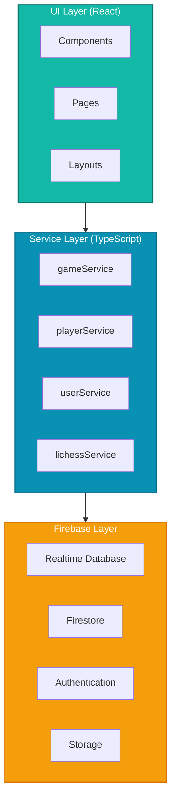

### Komponens Hierarchia

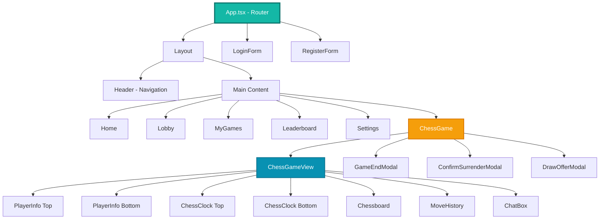

---

## 📁 Fájlstruktúra

```
chess-frontend/
├── src/
│   ├── main.tsx                    # Belépési pont
│   ├── App.tsx                     # Fő app komponens, routing
│   ├── types.ts                    # TypeScript típusdefiníciók
│   ├── index.css                   # Globális stílusok
│   │
│   ├── components/                 # Újrafelhasználható komponensek
│   │   ├── Layout.tsx              # Oldal layout wrapper
│   │   ├── header.tsx              # Navigációs header
│   │   ├── LoginForm.tsx           # Bejelentkezési form
│   │   ├── RegisterForm.tsx        # Regisztrációs form
│   │   ├── ChatBox.tsx             # Chat komponens
│   │   ├── ChessClock.tsx          # Óra komponens
│   │   ├── moveHistory.tsx         # Lépéstörténet
│   │   ├── PlayerInfo.tsx          # Játékos info display
│   │   ├── PlayerProfileModal.tsx  # Játékos profil modal
│   │   ├── CreateGameModal.tsx     # Új játék létrehozás
│   │   ├── GameEndModal.tsx        # Játék vége modal
│   │   ├── ConfirmSurrenderModal.tsx # Feladás megerősítés
│   │   ├── DrawOfferModal.tsx      # Döntetlen ajánlat
│   │   └── GeneralSettings.tsx     # Beállítások
│   │
│   ├── pages/                      # Oldal komponensek
│   │   ├── home.tsx                # Főoldal
│   │   ├── lobby.tsx               # Játék lobby
│   │   ├── mygames.tsx             # Saját játékok
│   │   ├── leaderboard.tsx         # Ranglista
│   │   ├── settings.tsx            # Beállítások oldal
│   │   └── test.tsx                # Test oldal
│   │
│   ├── services/                   # Service réteg (üzleti logika)
│   │   ├── gameService.ts          # Játék műveletek
│   │   ├── playerService.ts        # Játékos műveletek
│   │   ├── userService.ts          # Felhasználó műveletek
│   │   ├── lichessService.ts       # Lichess API integráció
│   │   └── index.ts                # Service exportok
│   │
│   ├── firebase/                   # Firebase konfiguráció
│   │   └── config.ts               # Firebase inicializálás
│   │
│   ├── hooks/                      # Custom React hooks
│   │   └── useAuth.ts              # Autentikációs hook
│   │
│   ├── ChessGame.tsx               # Fő játék konténer (logika)
│   └── ChessGameView.tsx           # Játék megjelenítés (UI)
│
├── public/                         # Statikus fájlok
├── package.json                    # Függőségek
├── tsconfig.json                   # TypeScript konfiguráció
├── vite.config.ts                  # Vite konfiguráció
└── eslint.config.js                # ESLint konfiguráció
```

---

## 🧩 Komponensek

### Core Komponensek

#### **1. App.tsx**
**Felelősség:** Routing és főbb oldalak összekapcsolása
```typescript
- BrowserRouter setup
- Route definíciók
- Layout wrapper minden oldalhoz
- Dinamikus document.title beállítás
```

#### **2. Layout.tsx**
**Felelősség:** Egységes oldal struktúra
```typescript
- Header komponens beágyazása
- Sidebar navigáció (desktop)
- Mobil header
- Main content area
```

#### **3. Header.tsx**
**Felelősség:** Navigáció és felhasználói interakció
```typescript
- Navigációs menü
- Felhasználó avatar és profil
- Login/Logout funkciók
- Mobil menü (hamburger)
- Firestore-ból avatar betöltés
```

### Játék Komponensek

#### **4. ChessGame.tsx** ⭐ (Legfontosabb)
**Felelősség:** Játék LOGIKA és állapotkezelés
```typescript
State Management:
- chessGameRef: chess.js instance
- chessPosition: FEN string (tábla pozíció)
- moveFrom: forrás mező kiválasztás
- optionSquares: lehetséges lépések
- lastMoveSquares: utolsó lépés kiemelése
- moveHistory: teljes játéktörténet
- gameData: Firebase-ből töltött játékadatok
- timeLeft: mindkét játékos ideje
- viewingHistoryIndex: történet nézegetés

Főbb funkciók:
- createNewGame(): Új játék létrehozása Firebase-ben
- updateGameInDb(): Lépés mentése
- onSquareClick(): Mező kattintás kezelés
- onPieceDrop(): Bábu mozgatás (drag & drop)
- canMove(): Ellenőrzi, hogy léphetek-e
- isMyPiece(): Saját bábu-e
- getMoveOptions(): Lehetséges lépések számítása
- handleSurrender(): Feladás
- handleOfferDraw(): Döntetlen ajánlás
- handleAbort(): Játék megszakítás
- handleTimeExpired(): Időtúllépés kezelés

Firebase Listeners:
- Auth state változás
- Játék state változás (realtime)
- Játékos csatlakozás figyelés
```

#### **5. ChessGameView.tsx**
**Felelősség:** Játék MEGJELENÍTÉS (tiszta UI komponens)

**Props (20+):**
- chessPosition, optionSquares, lastMoveSquares
- players, currentUser, currentTurn
- moveHistory, viewingHistoryIndex
- timeLeft, gameStatus
- callbacks: onSquareClick, onPieceDrop, stb.

**Layout:**
```
┌─────────────────────────────────────┐
│  Felső játékos + Óra                │
├─────────────────────────────────────┤
│                                     │
│         Sakktábla                   │
│                                     │
├─────────────────────────────────────┤
│  Alsó játékos + Óra                 │
└─────────────────────────────────────┘
│  Lépéstörténet | Chat | Gombok    │
└─────────────────────────────────────┘
```

**Features:**
- Animated background
- Floating chess pieces
- Responsive layout
- Board orientation (white/black)
- Status overlays (WAITING, etc.)

**ChessGame ↔ ChessGameView adatfolyam:**

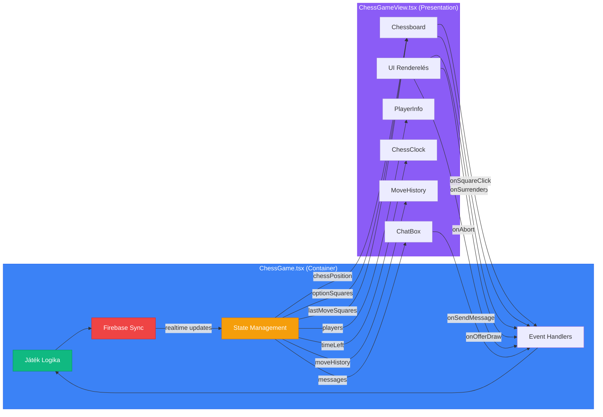

#### **6. PlayerInfo.tsx**
**Felelősség:** Játékos információ megjelenítés
```typescript
Display:
- Játékos név/email
- ELO rating
- ELO változás (±)
- Guest badge
- Klikkelve profil modal

Props:
- color: "white" | "black"
- player: Player object
- startingElo, currentElo, eloChange
```

#### **7. ChessClock.tsx**
**Felelősség:** Időmérés
```typescript
Features:
- Milliszekundumos pontosság
- Auto-pause amikor inaktív
- Visual feedback (piros amikor lejárt)
- Spinning ikon amikor aktív
- onTimeExpired callback

Működés:
- useEffect hook figyeli active prop-ot
- setInterval 100ms-enként frissít
- Date.now() alapú pontos időszámítás
```

#### **8. MoveHistory.tsx**
**Felelősség:** Lépéstörténet megjelenítés
```typescript
Features:
- Lépések párosítása (fehér-fekete)
- Klikkelve adott pozíció megtekintése
- Navigációs gombok (első, előző, következő, utolsó)
- "Élő játék" gomb a visszatéréshez
- Visual feedback a kiválasztott lépésről

Formátum:
1. e4    e5
2. Nf3   Nc6
3. Bb5   a6
```

#### **9. ChatBox.tsx**
**Felelősság:** Valós idejű chat
```typescript
Features:
- Firebase Realtime Database
- Saját/idegen üzenetek elkülönítése
- Auto-scroll új üzenetekhez
- Timestamp megjelenítés
- 200 karakter limit

Üzenet formátum:
{
  senderId: string,
  senderName: string,
  text: string,
  timestamp: number
}
```

### Modal Komponensek

#### **10. GameEndModal.tsx**
```typescript
Display:
- Győztes/vesztes/döntetlen
- Win reason (checkmate, timeout, stb.)
- ELO változások
- Új játék / Visszavágó gombok
```

#### **11. CreateGameModal.tsx**
```typescript
Settings:
- Time control (1, 3, 5, 10, 15, 30 perc)
- Increment (0, 1, 2, 5 másodperc)
- Opponent type (human/AI)
```

#### **12. ConfirmSurrenderModal.tsx**
```typescript
- Feladás megerősítő dialog
- Danger styling
- Visszavonás lehetőség
```

#### **13. DrawOfferModal.tsx**
```typescript
- Döntetlen ajánlat fogadása/elutasítása
- Ellenfél neve megjelenítés
- Auto-dismiss amikor ajánlat visszavonva
```

---

## 🔧 Szolgáltatások (Services)

A service réteg singleton osztályok formájában implementált, ami elkülöníti az üzleti logikát a UI-tól.

### Service Layer Architektúra

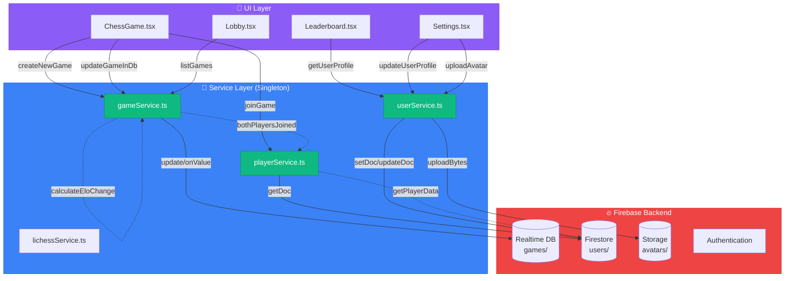

### **1. gameService.ts** 🎮
**Felelősség:** Játék életciklus és szabályok kezelése

```typescript
Főbb Metódusok:

createNewGame(gameId, settings)
├─ Inicializálja a játékot Firebase-ben
├─ Beállítja a time control-t
└─ Status: "waiting"

updateGameInDb(gameId, gameData, chessGame, fen, move)
├─ Menti a lépést
├─ Frissíti időket (increment-tel)
├─ Ellenőrzi játék vége feltételeket
│  ├─ Checkmate
│  ├─ Stalemate
│  ├─ Threefold repetition
│  ├─ Insufficient material
│  └─ Timeout
└─ ELO frissítés ha véget ért

calculateEloChange(winnerElo, loserElo, isDraw)
├─ K-factor: 32
├─ Expected score számítás
└─ ELO delta visszaadása

updateFirestoreOnGameEnd(gameId, gameData, winner)
├─ Firestore-ban frissíti statisztikákat
│  ├─ wins++
│  ├─ losses++
│  └─ draws++
├─ ELO frissítés mindkét játékosnak
└─ finalElo mentése játékba

saveStartingElo(gameId, whiteUid, blackUid)
└─ Kezdő ELO-k mentése játék indításkor

offerDraw(gameId, userId)
acceptDraw(gameId, gameData)
declineDraw(gameId)
└─ Döntetlen ajánlat kezelés

abortGame(gameId)
└─ Játék megszakítás (0-1 lépés esetén, ELO változás nélkül)

surrenderGame(gameId, gameData, surrenderingSide)
└─ Feladás (resignation)

handleTimeout(gameId, gameData, timeoutSide)
└─ Időtúllépés kezelés
```

**ELO Formula:**
```
Expected Score = 1 / (1 + 10^((opponent_elo - player_elo) / 400))
New ELO = Old ELO + K * (actual_score - expected_score)
ahol K = 32
```

**ELO Számítás Folyamat:**

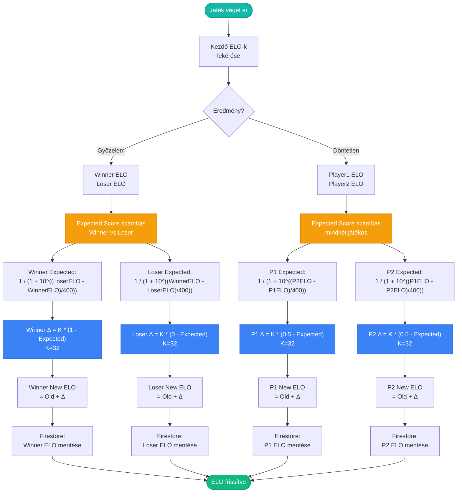

### **2. playerService.ts** 👥
**Felelősség:** Játékos műveletek és állapot

```typescript
Főbb Metódusok:

joinGame(gameId, user, gameData)
├─ Ellenőrzi, hogy csatlakozott-e már
├─ Meghatározza oldalt (white/black)
│  └─ Random ha üres, különben a szabad oldal
├─ Firestore-ból betölti player adatokat
└─ Firebase-be menti a játékost

getPlayerSide(user, gameData)
└─ Visszaadja: "white" | "black" | null

isPlayer(user, gameData)
└─ Játékos-e vagy néző

isSpectator(user, gameData)
└─ Néző-e

getPlayerData(userId)
└─ Firestore-ból lekéri teljes profilt

bothPlayersJoined(gameData)
└─ Mindkét játékos csatlakozott-e

getOpponent(user, gameData)
└─ Ellenfél adatainak lekérése

getRemainingTime(side, gameData, currentTurn)
├─ Számítja a hátralévő időt
├─ Csak a soron következő játékosnál csökken
└─ Figyelembe veszi az eltelt időt
```

### **3. userService.ts** 👤
**Felelősség:** Felhasználói profilok és statisztikák

```typescript
Főbb Metódusok:

createUserProfile(user)
├─ Új profil létrehozása Firestore-ban
├─ Kezdő ELO: 1200
└─ wins, losses, draws: 0

getUserProfile(user)
├─ Profil lekérése
└─ Ha nincs, létrehoz egyet

updateUserElo(uid, newElo)
└─ ELO frissítés

incrementWins(uid)
incrementLosses(uid)
incrementDraws(uid)
└─ Statisztika növelés

calculateNewElo(playerElo, opponentElo, score, kFactor=32)
└─ Pontos ELO számítás (használva gameService-ben)

updatePlayersElo(winner, whiteUid, blackUid, whiteElo, blackElo)
└─ Mindkét játékos ELO és statisztika frissítése
```

**UserProfile Interface:**
```typescript
{
  uid: string,
  email: string | null,
  displayName: string | null,
  elo: number,
  wins: number,
  losses: number,
  draws: number,
  createdAt: number,
  updatedAt: number
}
```

### **4. lichessService.ts** ♟
**Felelősség:** Lichess API integráció (AI játékokhoz)

```typescript
Funkciók:

challengeAI(level, color, clock)
├─ AI kihívás (1-8 szint)
└─ Visszaad: challenge ID és URL

makeMove(gameId, move, offeringDraw)
└─ Lépés küldése (UCI formátum)

streamGameState(gameId, onGameState, onGameFull)
└─ Real-time game stream (EventSource)

getOngoingGames()
└─ Folyamatban lévő játékok listája

getGame(gameId)
└─ Játék adatok lekérése

resign(gameId)
abort(gameId)
handleDrawOffer(gameId, accept)
└─ Játék műveletek

getCloudEvaluation(fen, multiPv)
getBestMove(fen)
└─ Lichess cloud analízis

uciToSan(uci, chess)
└─ UCI -> SAN konverzió
```

---

## 🔥 Firebase Integráció

### Firebase Config (firebase/config.ts)

```typescript
Inicializált Szolgáltatások:
├─ auth: Authentication
│  ├─ Email/Password
│  ├─ Google OAuth
│  ├─ Facebook OAuth
│  └─ Anonymous (Guest)
├─ db: Realtime Database (játékok)
├─ firestore: Firestore (felhasználók)
└─ storage: Cloud Storage (képek)

Environment Variables:
- VITE_FIREBASE_API_KEY
- VITE_FIREBASE_AUTH_DOMAIN
- VITE_FIREBASE_DATABASE_URL
- VITE_FIREBASE_PROJECT_ID
- VITE_FIREBASE_STORAGE_BUCKET
- VITE_FIREBASE_MESSAGING_SENDER_ID
- VITE_FIREBASE_APP_ID
```

### Adatbázis Struktúra

#### **Realtime Database**
```json
games/
  {gameId}/
    fen: "rnbqkbnr/pppppppp/8/8/8/8/PPPPPPPP/RNBQKBNR w KQkq - 0 1"
    moves: [
      {
        from: "e2",
        to: "e4",
        san: "e4",
        fen: "...",
        updatedAt: 1234567890,
        moveNumber: 1,
        timeLeft: { white: 300000, black: 300000 }
      }
    ]
    lastMove: { from: "e2", to: "e4", san: "e4" }
    players: {
      white: {
        uid: "user123",
        name: "Player 1",
        displayName: "Player 1",
        email: "player1@example.com",
        elo: 1200,
        wins: 5,
        losses: 3,
        draws: 1
      },
      black: { ... }
    }
    turn: "white" | "black"
    status: "waiting" | "ongoing" | "ended"
    started: false
    winner: "white" | "black" | "draw" | null
    winReason: "checkmate" | "timeout" | "resignation" | ...
    timeLeft: { white: 300000, black: 300000 }
    timeControl: 5  // minutes
    increment: 0    // seconds
    opponentType: "human" | "ai"
    createdAt: 1234567890
    updatedAt: 1234567890
    startingElo: { white: 1200, black: 1250 }
    finalElo: { white: 1215, black: 1235 }
    drawOfferedBy: "user123" | null
    chat: {
      {messageId}: {
        senderId: "user123",
        senderName: "Player 1",
        text: "Good game!",
        timestamp: 1234567890
      }
    }
```

#### **Firestore**

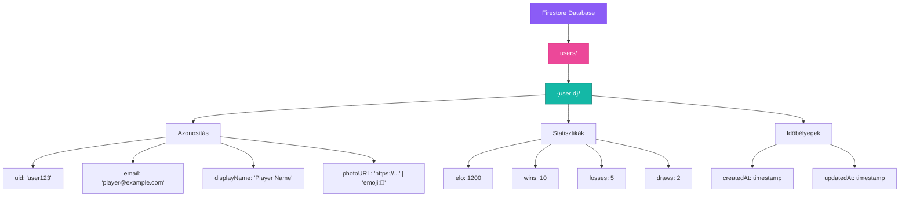

#### **Storage (Cloud Storage)**

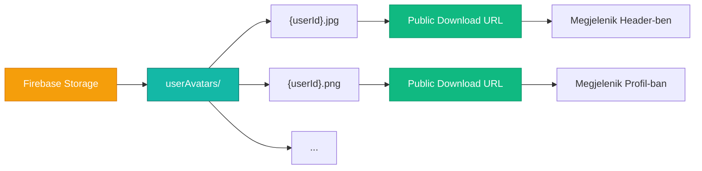

### Firebase műveletek összefoglalása

```mermaid
graph TD
    subgraph RTD["🔥 Realtime Database"]
        RTD_Read["📖 get / onValue<br/>(játék betöltése)"]
        RTD_Write["✏️ update / set<br/>(játék frissítése)"]
        RTD_Chat["💬 push / onValue<br/>(chat üzenetek)"]
    end
    
    subgraph FS["🗃️ Firestore"]
        FS_Read["📖 getDoc<br/>(profil lekérés)"]
        FS_Write["✏️ setDoc / updateDoc<br/>(profil frissítés)"]
        FS_Query["🔍 query / orderBy<br/>(ranglisták)"]
    end
    
    subgraph ST["📦 Storage"]
        ST_Upload["⬆️ uploadBytes<br/>(avatar feltöltés)"]
        ST_Download["⬇️ getDownloadURL<br/>(avatar URL)"]
    end
    
    subgraph AUTH["🔐 Authentication"]
        Auth_Login["🔑 signInWith...<br/>(bejelentkezés)"]
        Auth_Register["📝 createUser...<br/>(regisztráció)"]
        Auth_State["👤 onAuthStateChanged<br/>(auth állapot)"]
    end
    
    Services[Service Layer] --> RTD_Read
    Services --> RTD_Write
    Services --> RTD_Chat
    Services --> FS_Read
    Services --> FS_Write
    Services --> FS_Query
    Services --> ST_Upload
    Services --> ST_Download
    Services --> Auth_Login
    Services --> Auth_Register
    Services --> Auth_State
    
    style RTD fill:#ef4444,stroke:#dc2626,color:#fff
    style FS fill:#8b5cf6,stroke:#7c3aed,color:#fff
    style ST fill:#f59e0b,stroke:#d97706,color:#fff
    style AUTH fill:#14b8a6,stroke:#0f766e,color:#fff
    style Services fill:#3b82f6,stroke:#2563eb,color:#fff
```

---

## 🎲 Játéklogika

### Játék Életciklus

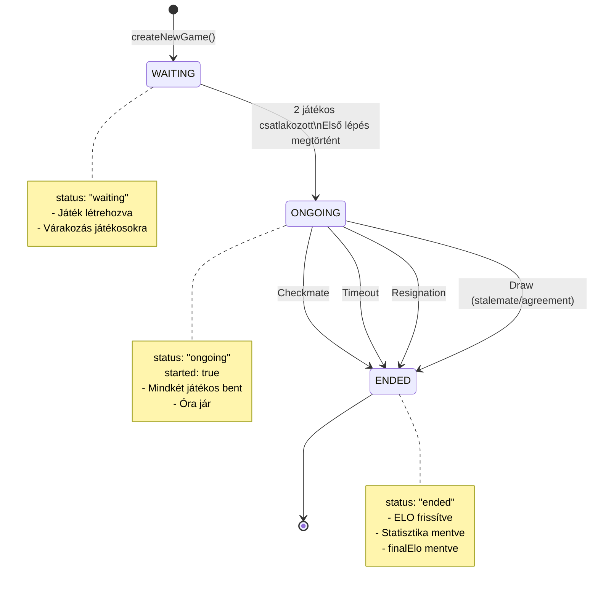

### Lépés Validáció Flow

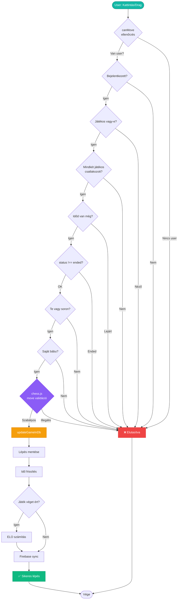

### Időkezelés

**Client-side:**
```typescript
1. Firebase-ből timeLeft betöltése
2. ChessClock komponens:
   - Ha active: számlálja az időt
   - Ha !active: megállítja
   - 100ms-enként frissít (smooth)
3. Amikor lejár: onTimeExpired() callback
```

**Server-side (Firebase-ben):**
```typescript
1. Lépéskor kiszámítja eltelt időt:
   elapsed = Date.now() - lastUpdatedAt
   
2. Lépő játékos idejét csökkenti:
   timeLeft[player] -= elapsed
   
3. Increment hozzáadása:
   timeLeft[player] += increment * 1000
   
4. Időtúllépés ellenőrzés:
   if (timeLeft[player] <= 0) {
     winner = opponent
     winReason = "timeout"
   }
```

### ELO Rendszer

**Képlet:**
```
Expected Score_A = 1 / (1 + 10^((ELO_B - ELO_A) / 400))
New ELO_A = Old ELO_A + K * (Actual Score - Expected Score)

ahol:
- K = 32 (rating change factor)
- Actual Score: 1 (win), 0.5 (draw), 0 (loss)
```

**Példa:**
```typescript
Player A: 1200 ELO
Player B: 1400 ELO

Expected_A = 1 / (1 + 10^((1400-1200)/400)) = 0.24
Expected_B = 1 / (1 + 10^((1200-1400)/400)) = 0.76

Ha A nyer:
New_ELO_A = 1200 + 32 * (1 - 0.24) = 1224 (+24)
New_ELO_B = 1400 + 32 * (0 - 0.76) = 1376 (-24)

Ha döntetlen:
New_ELO_A = 1200 + 32 * (0.5 - 0.24) = 1208 (+8)
New_ELO_B = 1400 + 32 * (0.5 - 0.76) = 1392 (-8)
```

---

## 🔄 Adatfolyam

### Játék Indítás Flow

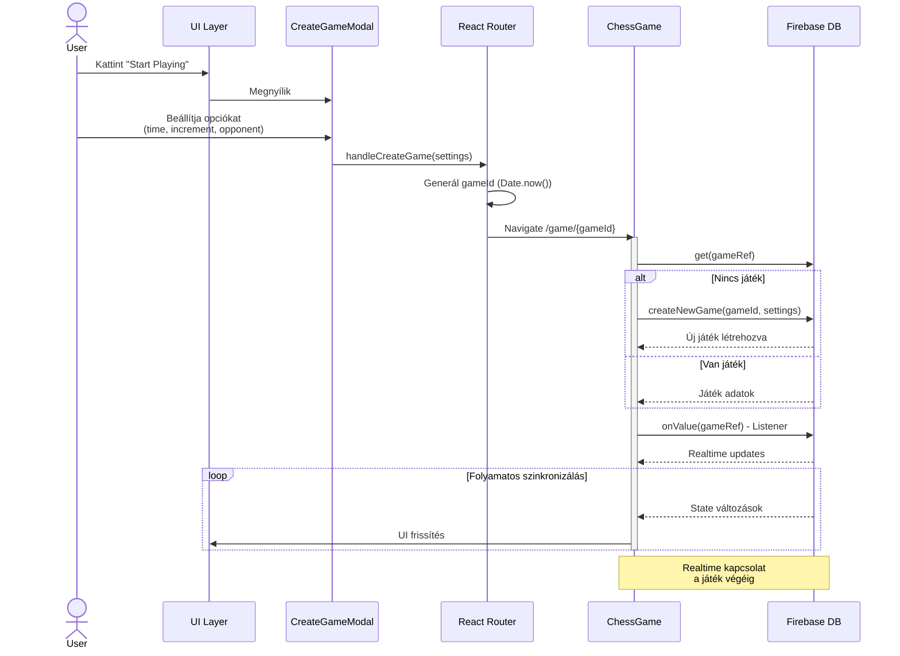

### Lépés Flow (Játékosok közötti interakció)

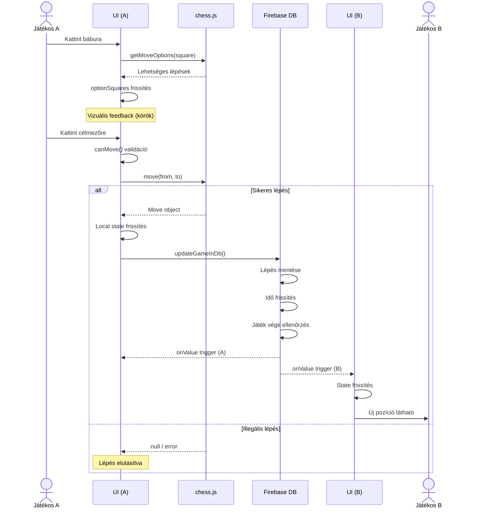

### Chat Flow

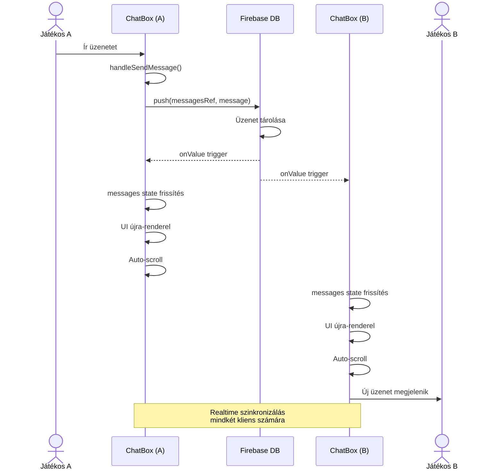

### Auth Flow

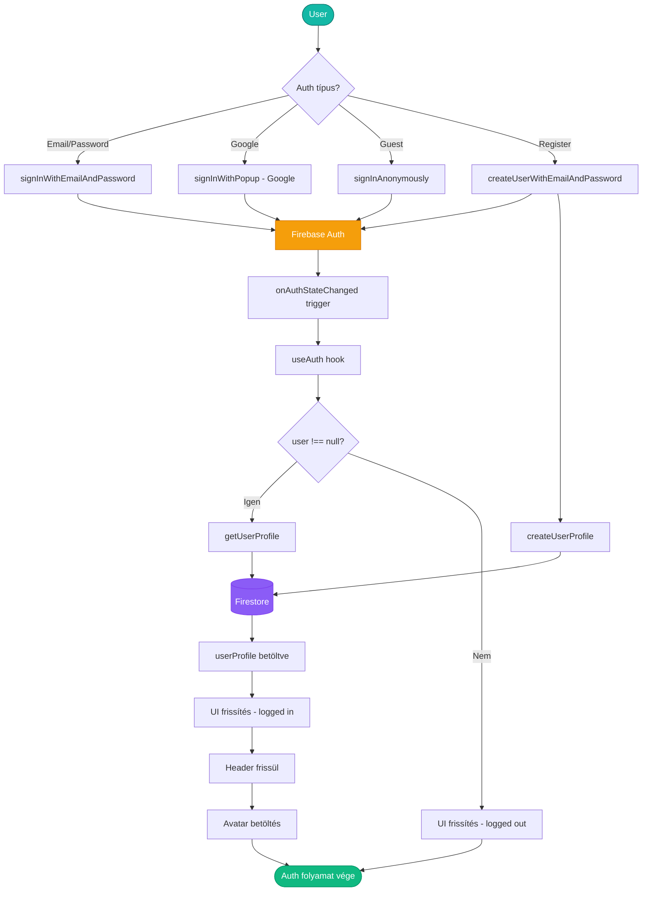

---

## 🎨 Betűstílusok

### Font Families

**1. Sans-serif (Alapértelmezett)**
```css
font-family: system-ui, Avenir, Helvetica, Arial, sans-serif;
```
- Használat: Minden szöveg alapértelmezetten
- Prioritás: system-ui → Avenir → Helvetica → Arial → sans-serif

**2. Monospace**
```css
font-family: ui-monospace, SFMono-Regular, Menlo, Monaco, Consolas, 
             "Liberation Mono", "Courier New", monospace;
```
- Használat:
  - Sakkjáték lépések (moveHistory)
  - Óra megjelenítés (ChessClock)
  - Game ID-k
  - User UID-k
  - Időbeállítások (CreateGameModal)

### Font Weights (Tailwind)

```typescript
font-normal   (400) - Alapértelmezett body szöveg
font-medium   (500) - Címkék, fontosabb szövegek
font-semibold (600) - Kiemelések, játékos nevek
font-bold     (700) - Címsorok (h1, h2, h3), gombok, fontos számok
```

**Használati példák:**
- `font-bold`: Főcímek, nagy számok (ELO, rangok), gombok
- `font-semibold`: Alcímek, játékos nevek, fontosabb információk
- `font-medium`: Általános címkék, menüpontok
- `font-normal`: Body szöveg, leírások

### Nincsenek használatban:
- `font-thin` (100)
- `font-extralight` (200)
- `font-light` (300)
- `font-extrabold` (800)
- `font-black` (900)

**Megjegyzés:** Nincsenek külön web fontok (Google Fonts, stb.) betöltve, csak rendszer fontokat használ az alkalmazás a gyors betöltés érdekében.

---

## 📦 Build és Deploy

### Development

```bash
npm run dev          # Dev server indítás (http://localhost:5173)
npm run lint         # ESLint ellenőrzés
```

### Production

```bash
npm run build        # TypeScript compile + Vite build
npm run preview      # Production build preview
```

### Környezeti Változók

`.env` fájl szükséges a következő változókkal:
```env
VITE_APP_TITLE=Chess Arena
VITE_FIREBASE_API_KEY=...
VITE_FIREBASE_AUTH_DOMAIN=...
VITE_FIREBASE_DATABASE_URL=...
VITE_FIREBASE_PROJECT_ID=...
VITE_FIREBASE_STORAGE_BUCKET=...
VITE_FIREBASE_MESSAGING_SENDER_ID=...
VITE_FIREBASE_APP_ID=...
```

---

## 🔒 Biztonság

### Autentikáció
- Firebase Authentication használata
- Email/Password hashing (Firebase által)
- OAuth providers (Google, Facebook)
- Guest mode (anonymous auth)

### Adatvédelem
- Realtime Database Security Rules
- Firestore Security Rules
- Client-side validáció
- Server-side validáció (Firebase Functions)

**Példa Security Rules:**
```javascript
{
  "rules": {
    "games": {
      "$gameId": {
        ".read": true,
        ".write": "auth != null"
      }
    },
    "users": {
      "$userId": {
        ".read": true,
        ".write": "$userId === auth.uid"
      }
    }
  }
}
```

---

## 🐛 Hibakezelés

### Firebase Hibák
```typescript
try {
  await firebaseOperation();
} catch (error) {
  console.error("Firebase error:", error);
  // UI feedback (toast, modal, stb.)
}
```

### Chess.js Hibák
```typescript
try {
  const move = chessGame.move({ from, to });
  if (!move) return false; // Invalid move
} catch {
  return false; // Illegal move
}
```

### Network Hibák
- Firebase automatikus reconnect
- Offline mode támogatás (Firestore)
- Loading states a UI-ban

---

## 🚀 Optimalizáció

### Performance
1. **React.memo()** - Komponens memoizáció (ahol szükséges)
2. **useCallback()** - Callback függvények memoizálása
3. **useMemo()** - Számítások cache-elése
4. **Lazy loading** - Route-based code splitting
5. **Firebase indexek** - Gyors query-k Firestore-ban

### Bundle Size
- Vite tree-shaking
- Code splitting (route-based)
- Lazy imports
- Production build minification

---

## 📊 Státusz Diagramok

### Játék Állapotok

```
    ┌─────────┐
    │ WAITING │
    └────┬────┘
         │ (2 players join)
         ↓
    ┌─────────┐
    │ ONGOING │
    └────┬────┘
         │ (checkmate/timeout/resignation/draw)
         ↓
    ┌─────────┐
    │  ENDED  │
    └─────────┘
```

### Játékos Interakciók

```
┌──────────────┐      ┌──────────────┐
│   Player A   │      │   Player B   │
└──────┬───────┘      └──────┬───────┘
       │ move e2-e4          │
       ├──────────────────►  │
       │                     │ receives update
       │                     │ (realtime listener)
       │                     │
       │          e7-e5 move │
       │  ◄──────────────────┤
       │ receives update     │
       │ (realtime listener) │
```

---

## 🎓 Best Practices

### Code Organization
1. **Service Layer Pattern** - Üzleti logika elkülönítése
2. **Presentation/Container Pattern** - UI és logika szétválasztása
3. **Single Responsibility** - Egy komponens = egy felelősség
4. **DRY Principle** - Kód újrafelhasználás

### State Management
1. **Local State** - useState hooks komponens state-hez
2. **Context API** - Global state (auth) shared state-hez
3. **Firebase Listeners** - Realtime synchronization
4. **Ref-ek** - DOM access és non-reactive értékek

### TypeScript Usage
1. **Strict Mode** - Maximális típusbiztonság
2. **Interfaces** - Adatstruktúrák definiálása
3. **Type Guards** - Runtime type checking
4. **Generic Types** - Újrafelhasználható típusok

---

## 📝 Changelog & Roadmap

### Implementált Funkciók ✅
- ✅ Valós idejű multiplayer
- ✅ Időmérés increment-tel
- ✅ ELO rendszer
- ✅ Chat
- ✅ Lépéstörténet
- ✅ Döntetlen ajánlás
- ✅ Feladás
- ✅ Játék megszakítás
- ✅ Ranglista
- ✅ Guest mode

### Tervezett Funkciók 🔮
- 🔮 AI játék (Lichess integráció)
- 🔮 Rematch funkció
- 🔮 Friend system
- 🔮 Tournament mode
- 🔮 Puzzle of the day
- 🔮 Game analysis
- 🔮 Opening explorer

---

## 🤝 Közreműködés

### Branch Strategy
```
main          (production-ready)
  └─ develop  (development)
       ├─ feature/xyz
       ├─ bugfix/abc
       └─ hotfix/123
```

### Commit Convention
```
feat: új funkció
fix: bugfix
refactor: kód refaktorálás
style: formázás, styling
docs: dokumentáció
test: tesztek
chore: egyéb (build, config, stb.)
```

---

## 🚀 Gyors Indítás (Getting Started)

### Teljes Folyamat

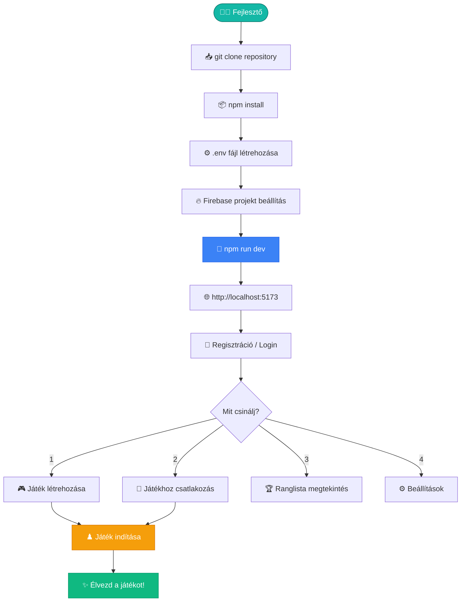

### Első Játék Flow

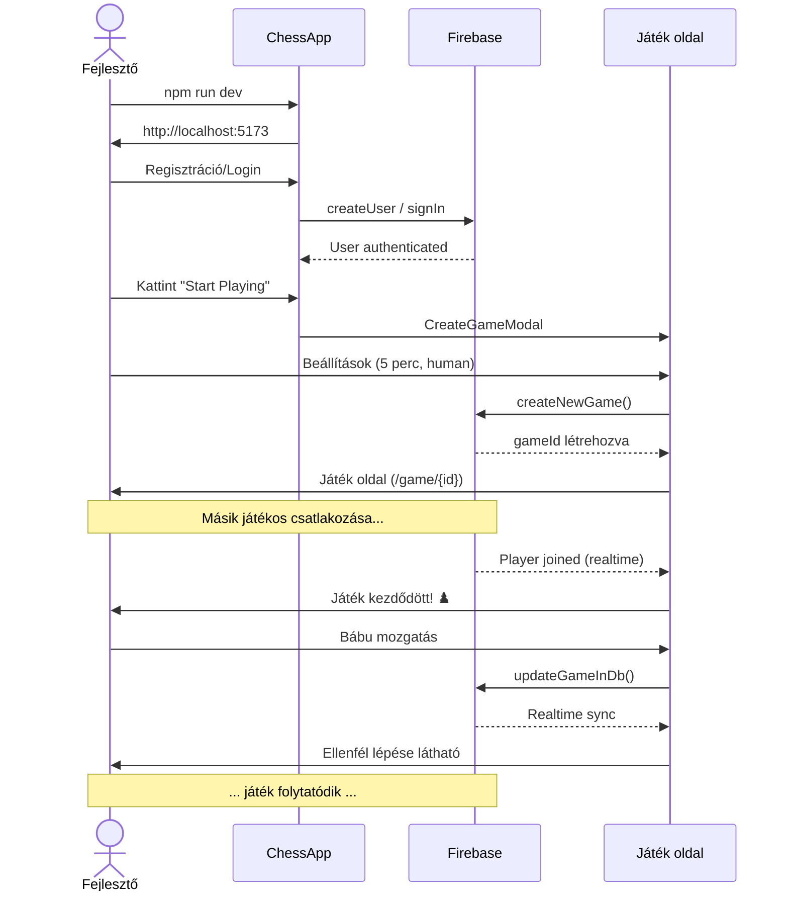

---

## 📞 Kapcsolat & Support

- **GitHub Issues:** [github.com/sandortorok/ChessApp/issues]
- **Discord:** [Coming soon]
- **Email:** [Coming soon]

---

**Utolsó frissítés:** 2025.01.27  
**Verzió:** 1.0.0  
**Készítette:** Copilot AI + sandortorok

---

*Ez a dokumentáció élő dokumentum, folyamatosan frissül a projekt fejlődésével.*
